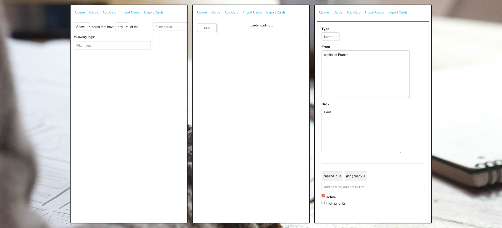

# Kaado3

An old web-based note-taking/zettelkasten app I did a while ago.
Core idea is that you create notes of different types, then handle them one by one in a queue.s

This (semi-broken) prototype is a precursor to [the queue](https://github.com/koljapluemer/obsidian-the-queue), which actually works.

## Tech

- Js
- Vue
- [basscsss](https://basscss.com/)
- used to have pinia, but I removed it due to throwing weird errors

## Running it

- `npm i`
- `npm run serve`